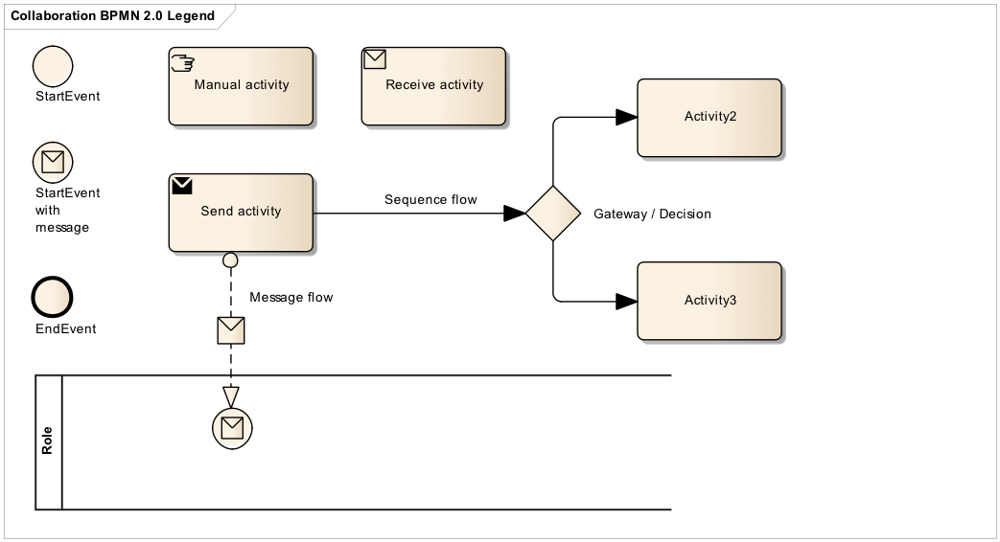

[[business-process-diagram]]
= Business process Diagram

[[legend-for-bpmn-diagrams]]
== Legend for BPMN diagrams

The diagrams are expressed in the BPMN notation.
The diagram below serves as an explanation for the diagrams used in the process descriptions.

.BPMN legend

